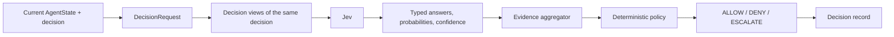
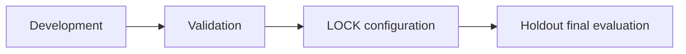

# Jev Control Plane

A small, framework-neutral control plane for agent decisions. Jev returns typed probabilistic evidence; transparent aggregation preserves agreement and conflict; deterministic policy emits `ALLOW`, `DENY`, or `ESCALATE`.

## Architecture



The control plane owns the decision boundary, not the agent's execution lifecycle. Framework adapters and non-Jev decision providers are future work, not V1 dependencies.

## Quick start

Python 3.11+ is required. Install the project and official TypeSafe SDK:

```powershell
python -m pip install -e .
```

Run the deterministic, offline Failure Lab plumbing example:

```powershell
python examples/run_mock_experiment.py
```

This writes a uniquely named run under `experiments/runs/`. Outputs are labeled `mock`; they are not Jev performance. Run the live control-loop example after setting `TYPESAFE_API_KEY`:

```powershell
python examples/decision_flow.py
```

Run tests with `python -m unittest discover -s tests -v`.

## Failure Lab

The benchmark's primary unit is one decision. Cases store only the decision state/question and expected final action with ground-truth provenance; perturbation annotations are separate. The current Development cases use developer-authored synthetic rules. Their labels are independent of Jev outputs, but have not been independently validated and do not establish real-world validity. The runner executes the Jev path only, in live TypeSafe or explicitly labeled deterministic mock mode.



The Holdout runner requires a write-once configuration lock created from a completed Validation run. Split folders and local digests reduce accidental tuning leakage; they do not establish benchmark representativeness or statistical validity. Validation and Holdout are currently unpopulated.

## Results

**Live Jev performance: Not measured yet.** The included Development data is small and synthetic. Mock output exists only to test dataset loading, the existing policy loop, failure retention, metrics, and artifact generation. No comparative, calibration, safety, or speed claims are made.

## Research and contributor notes

- [Authoritative experimental protocol](EXPERIMENT_PROTOCOL.md)
- [Failure Lab run guide](experiments/README.md)
- [Dataset schema and split layout](experiments/datasets/README.md)
- [Ground-truth construction rules](experiments/datasets/ground_truth_rules.md)
- [Project specification](SPEC.md)
- [Milestone tasks and evidence trail](.genesis/PLAN.md)

The Noul API exposes a yes probability without a separate confidence field. The adapter preserves that distinction; policy thresholds are experimental defaults and must be selected on Validation, then frozen before Holdout.
