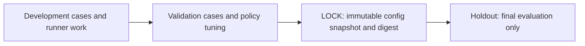

# Failure Lab

The Failure Lab measures individual Jev-controlled decisions against independent ground truth. It records decisions and failures; it does not try to prove Jev is safe or claim that it outperforms another model.

## Decision path

```mermaid
flowchart LR
    C[Minimal benchmark case] --> R[Experiment runner]
    R --> V[Configured Jev views of one decision]
    V --> J[Jev adapter]
    J --> E[Raw Jev evidence]
    E --> A[Transparent evidence aggregation]
    A --> P[Deterministic policy]
    P --> O[ALLOW / DENY / ESCALATE]
    O --> G[Compare final action to independent ground truth]
    G --> M[Decision metrics and failure categories]
```



The current runner executes only the Jev control path. `jev_live` calls TypeSafe through the existing adapter. `mock` runs the same control plane with deterministic Jev-shaped synthetic outputs. Mock answers depend on state and view definitions, not expected actions. Mock records and timings are never Jev measurements.

## Case contract and provenance

Each `cases.jsonl` row has exactly four top-level fields: case ID, `AgentState`, decision question, and ground truth. Ground truth contains the expected final control action and provenance (`deterministic_rule`, `human_label`, `labeled_dataset`, or `environment_outcome`), a reference, and certainty (`high`, `medium`, `low`, `unknown`). A case cannot declare an expected Noul, Choice, or Score answer.

Perturbation family is stored in `annotations.jsonl`, joined by case ID. It describes the case's intended stressor; it does not claim Jev exhibited the named behavior. Result records retain the full decision record and label cross-view disagreement separately.

## Split discipline



Development, Validation, and Holdout are isolated case directories. LOCK is not a case split: it is a write-once snapshot of dataset identity, model, views, execution mode, and policy made from a Validation config. The runner refuses to read Holdout unless a saved lock matches those settings. Changing a threshold, view, model, dataset ID, or mode requires a new validation cycle and lock.

The code can prevent accidental split selection and configuration drift through its API. It cannot prevent an operator from copying Holdout cases into Development or changing files outside the store; protect the Holdout source and review its digest as part of an actual study. Folders and locks do not establish representative sampling, label validity, statistical power, blinding, or external validity.

## Run and artifacts

```powershell
python -m pip install -e .
python examples/run_mock_experiment.py
```

Each unique directory under `runs/` receives a manifest, `results.jsonl`, and summary. Existing run IDs cannot be overwritten. Case-level failures are retained with error type and ground-truth provenance; raw exception text is omitted to reduce risk of recording secrets. An interrupted run remains with status `running` and its partial case records.

Manifest fields include experiment/run/dataset IDs, split digest, config digest and snapshot, execution mode, model, views, policy version, lock ID, Python version, and status. Each result includes case ID, expected and final actions, ground-truth provenance/certainty, optional perturbation annotation, agreement, consensus action when defined, decision and policy error indicators, escalation, latency, failure category, and the structured decision record. State text itself is not duplicated in the run record; the fingerprint joins the record to the source dataset.

### Metrics

| Metric | Definition |
| --- | --- |
| Final-action accuracy | Exact final `ControlAction` match, including `ESCALATE` only when it is the expected action; denominator is completed decisions. |
| Error rate | Incorrect final actions / completed decisions. Run errors are reported separately. |
| Action rates | Completed ALLOW, DENY, or ESCALATE actions / completed decisions. |
| View agreement | Counts unanimous mapped actions, explicit disagreement, and unmapped evidence separately. |
| Policy escalation | Count of completed decisions whose policy output was ESCALATE. |
| Latency | Wall time per attempted case through the local control loop. Mock latency is harness timing, not Jev latency. |
| Throughput | Attempted cases / elapsed runner time. Mock throughput is not Jev throughput. |
| Failure family | Counts and exact-action results grouped by separate case annotation. |

Median latency is emitted when there are observations. P95 latency is withheld for fewer than 20 observations. Accuracy is among completed decisions; `run_error_rate` ensures failed calls remain visible rather than disappearing from the report.

`jev_decision_error` has a deliberately narrow operational definition: all mapped views agree on an action, and that action differs from independent ground truth. A raw view cannot be individually called correct or incorrect because the benchmark contains no per-view expected labels. `policy_action_error` marks an incorrect final policy action when the unanimous mapped Jev action matched ground truth. Cross-view disagreement and unmapped evidence remain separate categories. Step, trajectory, and task outcomes are not collapsed into decision failures and are not implemented in this milestone.

Calibration, Brier score, ECE, cost, risk-coverage, Safe Autonomous Coverage, and trajectory success are not calculated from this run format. They remain future research work requiring appropriate labels and evaluation designs.

## Initial perturbation families

| Family | Milestone 2 status |
| --- | --- |
| Clean baseline | Represented in synthetic Development data. |
| Irrelevant context | Represented in synthetic Development data. |
| Ambiguity | Represented in synthetic Development data. |
| Conflicting evidence | Represented in synthetic Development data. |
| OOD / distribution shift | One synthetic unfamiliar-domain case; does not establish broad OOD coverage. |
| Adversarial state | One synthetic instruction-pressure case; not a security benchmark. |
| Cross-view disagreement | Separate annotation and measured evidence agreement; the case label does not assert that Jev will disagree. |
| Threshold sensitivity | Annotation and configurable policy are present. Automated threshold sweeps or policy-only replay are not implemented; compare validation runs carefully and do not tune on Holdout. |

## Results status

**Live Jev performance: Not measured yet.** There is no live API observation in the repository until a `jev_live` run is executed with a valid key. The included Development cases are hand-authored synthetic examples and are not a representative benchmark.

The recorded mock plumbing run evaluated 8 Development cases: 5 exact final actions matched ground truth, 3 did not, and all 8 escalated (accuracy 62.5%; escalation rate 100%). Two cases had unanimous mapped views, six had disagreement, and there were no runner errors. Median local mock control-loop latency was 0.207 ms; p95 is withheld because there were fewer than 20 observations. These are measurements of this deterministic mock and local harness only, not Jev performance. See the machine-readable run under `runs/`; rerunning creates a new immutable run directory rather than overwriting it.
